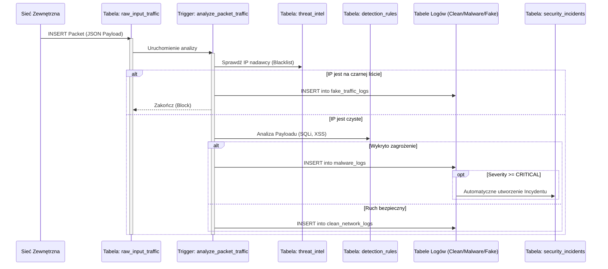
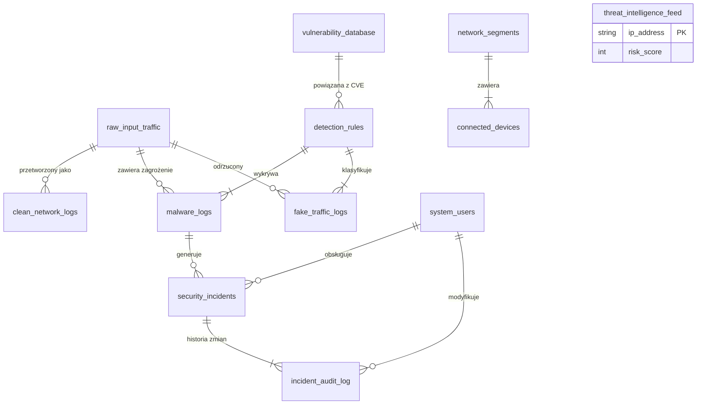

# Dokumentacja Techniczna Systemu Bazy Danych IDS/IPS (SIEM) 
**Technologia:** PostgreSQL 14+  
**Autorzy:** Jakub Szymczak, Tymoteusz Kruk, Kamil Pawelczak 


---

## 1. Wstęp
Projekt realizuje zaawansowaną symulację systemu **IDS/IPS** (Intrusion Detection/Prevention System) oraz **SIEM** (Security Information and Event Management) w oparciu o silnik relacyjnej bazy danych.

System działa w modelu **Store-and-Analyze**. Głównym celem jest:
*   Przechwytywanie surowego ruchu sieciowego.
*   Analiza w czasie rzeczywistym przy użyciu Triggerów i Procedur Składowanych.
*   Automatyczna klasyfikacja ruchu (**Czysty, Malware, Boty**).
*   Zarządzanie incydentami bezpieczeństwa (**Workflow analityka SOC**).

---

## 2. Architektura Systemu

### 2.1 Diagram Przepływu Danych (Sequence Diagram)
Poniższy diagram przedstawia cykl życia pojedynczego pakietu wpadającego do systemu.



### 2.2 Diagram Relacji Encji (ERD)
Struktura bazy danych składa się z 12 powiązanych tabel zarządzających różnymi aspektami bezpieczeństwa.



---

## 3. Opis Struktury Danych (Schema)

### 3.1 Moduł Konfiguracyjny (Słowniki)
Służy do definiowania reguł bezpieczeństwa i struktury sieci.

| Tabela | Opis | Kluczowe Pola |
| :--- | :--- | :--- |
| `system_users` | Użytkownicy systemu (Analitycy, Admini). | `role`, `is_active` |
| `network_segments` | Segmentacja sieci (DMZ, LAN, IoT). | `cidr_block`, `security_level` |
| `connected_devices` | Inwentaryzacja sprzętu. Śledzi zaufanie. | `mac_address`, `trust_level` |
| `detection_rules` | Definicje ataków (np. sygnatury SQLi). | `severity_level`, `threat_type` |
| `vulnerability_database` | Baza CVE powiązana z regułami. | `cve_id`, `base_score` |
| `threat_intelligence_feed` | Zewnętrzne listy "złych IP". | `risk_score`, `provider` |

### 3.2 Moduł Przetwarzania (Logi)
Dane generowane automatycznie przez triggery w procesie analizy.

| Tabela | Opis | Kluczowe Pola |
| :--- | :--- | :--- |
| `raw_input_traffic` | Bufor wejściowy. Każdy pakiet tu trafia. | `raw_packet_payload` (JSONB) |
| `clean_network_logs` | Ruch uznany za bezpieczny. | `processed_at` |
| `malware_logs` | Ruch zawierający złośliwy kod. | `quarantined_payload` |
| `fake_traffic_logs` | Ruch botów, skanery, blokady IP. | `action_taken`, `request_frequency` |

### 3.3 Moduł Zarządzania Incydentami (SOC)
Obsługa zdarzeń przez analityków bezpieczeństwa.

| Tabela | Opis | Kluczowe Pola |
| :--- | :--- | :--- |
| `security_incidents` | Tickety dla analityków. | `status`, `severity`, `assigned_user` |
| `incident_audit_log` | Historia zmian (RODO/Compliance). | `old_status`, `new_status`, `changed_by` |

---

## 4. Logika Biznesowa (Triggery)
System posiada 5 kluczowych triggerów sterujących przepływem danych:

1.  **`analyze_packet_traffic` (Główny Silnik)**
    *   Sprawdza IP w `threat_intelligence_feed`.
    *   Analizuje JSON pod kątem słów kluczowych (np. `UNION SELECT`, `<script>`).
    *   Rozdziela ruch do odpowiednich tabel logów.
2.  **`auto_incident_creation` (Automatyzacja)**
    *   Nasłuchuje na `malware_logs`.
    *   Dla zagrożeń `CRITICAL` tworzy wpis w `security_incidents` ze statusem `OPEN`.
3.  **`detect_scan_burst` (Obrona Aktywna)**
    *   Jeśli jedno IP zostanie zablokowane 5 razy w ciągu minuty w `fake_traffic_logs`, trafia na czarną listę (Auto-Ban).
4.  **`audit_incident_changes` (Audyt)**
    *   Rejestruje każdą zmianę statusu lub przypisania incydentu.
5.  **`update_device_presence` (Visibility)**
    *   Aktualizuje `last_seen` w tabeli urządzeń przy każdym pakiecie.

---

## 5. Scenariusze Testowe (Test Cases)

### 1. Weryfikacja Threat Intelligence (Blokowanie na wejściu)
**Cel:** Sprawdź, czy ruch z adresów IP znajdujących się w `threat_intelligence_feed` został zablokowany bez głębokiej analizy.
**Oczekiwany wynik:** Rekordy w tabeli `fake_traffic_logs` z akcją `BLOCKED_THREAT_INTEL`.

```sql
SELECT 
    f.source_ip, 
    f.action_taken, 
    f.detection_time,
    t.threat_category,
    t.risk_score
FROM fake_traffic_logs f
JOIN threat_intelligence_feed t ON f.source_ip = t.ip_address
WHERE f.action_taken = 'BLOCKED_THREAT_INTEL';
```

### 2. Detekcja SQL Injection (Malware Trigger)
**Cel:** Potwierdź, że payload zawierający `"UNION SELECT"` trafił do logów malware.
**Oczekiwany wynik:** Rekordy w `malware_logs` wskazujące na regułę SQL Injection.

```sql
SELECT 
    m.log_id,
    m.source_ip,
    d.rule_name,
    m.quarantined_payload
FROM malware_logs m
JOIN detection_rules d ON m.detected_rule_id = d.rule_id
WHERE d.rule_name LIKE '%SQLi%';
```

### 3. Automatyczne tworzenie Incydentów (Trigger Logic)
**Cel:** Sprawdź, czy dla krytycznego malware system sam utworzył ticket w `security_incidents`.
**Oczekiwany wynik:** Incydenty o statusie `CRITICAL` powiązane z logami malware.

```sql
SELECT 
    i.incident_id,
    i.title,
    i.severity,
    i.created_at,
    m.source_ip AS attacker_ip
FROM security_incidents i
JOIN malware_logs m ON i.primary_malware_log_id = m.log_id
WHERE i.severity = 'CRITICAL';
```

### 4. Audyt zmian w incydentach
**Cel:** Sprawdź, czy historia zmian statusu incydentu zapisała się w logu audytowym.
**Oczekiwany wynik:** Lista zmian (np. z `OPEN` na `RESOLVED`) wraz z nazwą użytkownika.

```sql
SELECT 
    a.audit_id,
    i.title AS incident_title,
    u.username AS changed_by,
    a.old_status,
    a.new_status,
    a.change_timestamp
FROM incident_audit_log a
JOIN security_incidents i ON a.incident_id = i.incident_id
JOIN system_users u ON a.changed_by_user_id = u.user_id
ORDER BY a.change_timestamp DESC;
```

### 5. Logowanie czystego ruchu
**Cel:** Upewnij się, że zwykły ruch (np. HTTP GET) trafia do `clean_network_logs`.
**Oczekiwany wynik:** Rekordy, które nie są malwarem ani fałszywym ruchem.

```sql
SELECT 
    c.clean_id,
    c.source_ip,
    c.dest_ip,
    rt.raw_packet_payload ->> 'url' as accessed_url
FROM clean_network_logs c
JOIN raw_input_traffic rt ON c.original_packet_id = rt.packet_id
LIMIT 10;
```

### 6. Mechanizm Auto-Ban (Wykrywanie skanowania)
**Cel:** Sprawdź, czy system automatycznie dodał agresywne IP do bazy Threat Intel.
**Oczekiwany wynik:** Nowy wpis w `threat_intelligence_feed` z dostawcą `Internal IDS`.

```sql
SELECT * FROM threat_intelligence_feed 
WHERE provider_name = 'Internal IDS' 
  AND threat_category = 'AUTO_BAN_SCANNER';
```

### 7. Widok kolejki analityka (Dashboard)
**Cel:** Sprawdź, czy widok `v_analyst_queue` łączy dane poprawnie (Incydent + Użytkownik + Atakujący).
**Oczekiwany wynik:** Czytelna tabela dla analityka (bez ID, same nazwy).

```sql
SELECT * FROM v_analyst_queue 
WHERE status != 'RESOLVED'
ORDER BY severity DESC;
```

### 8. Wydajność Indeksu JSON (Explain Analyze)
**Cel:** Sprawdź, czy baza danych używa indeksu GIN do przeszukiwania JSON-a.
**Oczekiwany wynik:** W planie zapytania powinno pojawić się `Bitmap Heap Scan` lub `Bitmap Index Scan`.

```sql
EXPLAIN ANALYZE
SELECT packet_id, source_ip 
FROM raw_input_traffic 
WHERE raw_packet_payload @> '{"method": "GET"}';
```

### 9. Aktualizacja statusu urządzenia (Network Visibility)
**Cel:** Sprawdź, czy aktywność sieciowa aktualizuje pole `last_seen` w tabeli urządzeń.
**Oczekiwany wynik:** Urządzenia, które generowały ruch w ciągu ostatnich minut.

```sql
SELECT 
    hostname, 
    ip_address, 
    last_seen,
    NOW() - last_seen as time_since_last_packet
FROM connected_devices
WHERE last_seen > NOW() - INTERVAL '1 hour'
ORDER BY last_seen DESC;
```

### 10. Raport Podatności (CVE Mapping)
**Cel:** Połącz wykryty atak z bazą wiedzy o podatnościach.
**Oczekiwany wynik:** Lista ataków wraz z opisem podatności (CVE), na którą były wycelowane.

```sql
SELECT 
    m.source_ip,
    m.detection_time,
    d.rule_name,
    v.cve_id,
    v.description AS vulnerability_description,
    v.base_score AS cvss_score
FROM malware_logs m
JOIN detection_rules d ON m.detected_rule_id = d.rule_id
JOIN vulnerability_database v ON d.related_cve_id = v.cve_id
ORDER BY v.base_score DESC;
```

---

## 6. Optymalizacja Wydajności
W projekcie zastosowano indeksy specjalistyczne PostgreSQL:

*   **GIN (Generalized Inverted Index):** Na kolumnie `raw_packet_payload` (JSONB). Umożliwia błyskawiczne przeszukiwanie treści pakietów.
*   **BRIN (Block Range Index):** Na kolumnach czasowych (`arrival_time`). Oszczędza miejsce przy dużych zbiorach danych historycznych.
*   **B-Tree:** Na kluczach obcych i adresach IP.

**Przykład analizy wydajności:**
```sql
EXPLAIN ANALYZE 
SELECT * FROM raw_input_traffic 
WHERE raw_packet_payload @> '{"method": "GET"}';
-- Wynik: Bitmap Index Scan on idx_raw_payload_gin
```

---

## 7. Podsumowanie
Stworzony system bazy danych spełnia wymagania nowoczesnego rozwiązania **SIEM** w skali mikro. Jest odporny na błędy, audytowalny i zoptymalizowany pod kątem JSON. Architektura modularna pozwala na łatwe dodawanie nowych reguł detekcji bez przestojów systemu.
