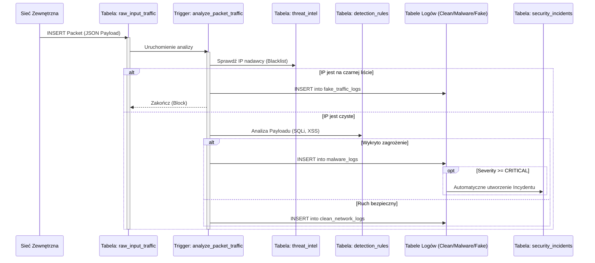
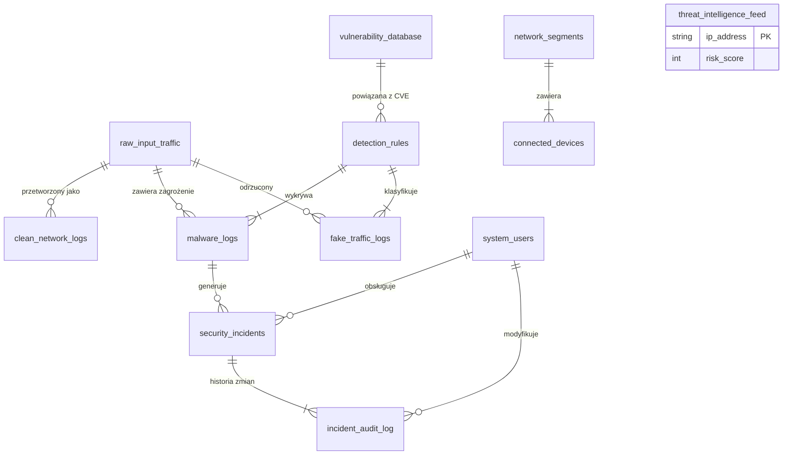

Jasne, oto dokument z poprawioną numeracją, bez zmiany pozostałej treści.

---

# Dokumentacja Techniczna Systemu Bazy Danych IDS/IPS (SIEM)
**Technologia:** PostgreSQL 14+
**Autorzy:** Jakub Szymczak, Tymoteusz Kruk, Kamil Pawelczak

---

## 1. Wstęp
Projekt realizuje zaawansowaną symulację systemu **IDS/IPS** (Intrusion Detection/Prevention System) oraz **SIEM** (Security Information and Event Management) w oparciu o silnik relacyjnej bazy danych.

System działa w modelu **Store-and-Analyze**. Głównym celem jest:
*   Przechwytywanie surowego ruchu sieciowego.
*   Analiza w czasie rzeczywistym przy użyciu Triggerów i Procedur Składowanych.
*   Automatyczna klasyfikacja ruchu (**Czysty, Malware, Boty**).
*   Zarządzanie incydentami bezpieczeństwa (**Workflow analityka SOC**).

---

## 2. Architektura Systemu

### 2.1. Diagram Przepływu Danych (Sequence Diagram)
Poniższy diagram przedstawia cykl życia pojedynczego pakietu wpadającego do systemu.



### 2.2. Diagram Relacji Encji (ERD)
Struktura bazy danych składa się z 12 powiązanych tabel zarządzających różnymi aspektami bezpieczeństwa.


---

## 3. Opis Struktury Danych (Schema)

### 3.1. Moduł Konfiguracyjny i Słownikowy

#### 3.1.1. Tabela: `system_users`
Przechowuje informacje o personelu obsługującym system (Analitycy SOC, Administratorzy).

| Nazwa Kolumny | Typ Danych | Ograniczenia | Opis |
| :--- | :--- | :--- | :--- |
| `user_id` | `SERIAL` | **PK** | Unikalny identyfikator użytkownika. |
| `username` | `VARCHAR(50)`| `UNIQUE`, `NOT NULL` | Login systemowy. |
| `role` | `VARCHAR(20)`| `CHECK IN (...)` | Rola w systemie: 'ADMIN', 'ANALYST_L1', 'ANALYST_L2', 'AUDITOR'. |
| `email` | `VARCHAR(100)`| - | Adres kontaktowy. |
| `is_active` | `BOOLEAN` | `DEFAULT TRUE` | Flaga aktywności konta (zamiast usuwania). |

#### 3.1.2. Tabela: `network_segments`
Definiuje logiczne strefy sieciowe w celu kontekstowej oceny zagrożeń.

| Nazwa Kolumny | Typ Danych | Ograniczenia | Opis |
| :--- | :--- | :--- | :--- |
| `segment_id` | `SERIAL` | **PK** | Unikalny identyfikator segmentu. |
| `segment_name` | `VARCHAR(50)`| `NOT NULL` | Nazwa strefy (np. "DMZ", "Internal LAN"). |
| `cidr_block` | `CIDR` | `NOT NULL` | Zakres adresacji IP w formacie CIDR (np. 192.168.1.0/24). |
| `security_level` | `INT` | 1-10 | Poziom bezpieczeństwa strefy (10 = najwyższy, np. serwerownia). |

#### 3.1.3. Tabela: `connected_devices`
Inwentaryzacja zasobów (Asset Management). Pozwala rozróżnić ruch zaufany od nieznanego.

| Nazwa Kolumny | Typ Danych | Ograniczenia | Opis |
| :--- | :--- | :--- | :--- |
| `device_id` | `SERIAL` | **PK** | Unikalny identyfikator urządzenia. |
| `mac_address` | `MACADDR` | `UNIQUE`, `NOT NULL` | Fizyczny adres karty sieciowej. |
| `ip_address` | `INET` | - | Aktualnie przypisany adres IP. |
| `hostname` | `VARCHAR(100)`| - | Nazwa domenowa urządzenia. |
| `segment_id` | `INT` | **FK** | Powiązanie z tabelą `network_segments`. |
| `trust_level` | `INT` | 0-100 | Poziom zaufania do urządzenia (Reputacja). |
| `last_seen` | `TIMESTAMP` | `DEFAULT NOW()` | Data ostatniej aktywności sieciowej (aktualizowana przez Trigger). |

#### 3.1.4. Tabela: `detection_rules`
Baza sygnatur i reguł behawioralnych służąca do klasyfikacji zagrożeń.

| Nazwa Kolumny | Typ Danych | Ograniczenia | Opis |
| :--- | :--- | :--- | :--- |
| `rule_id` | `SERIAL` | **PK** | Unikalny identyfikator reguły. |
| `rule_name` | `VARCHAR(100)`| `NOT NULL` | Nazwa zagrożenia (np. "SQL Injection Pattern"). |
| `description` | `TEXT` | - | Szczegółowy opis techniczny reguły. |
| `related_cve_id`| `VARCHAR(20)`| **FK** | Powiązanie z bazą podatności `vulnerability_database`. |
| `threat_type` | `VARCHAR(20)`| - | Kategoria: 'MALWARE', 'THREAT_INTEL', 'ANOMALY'. |
| `severity_level`| `INT` | 1-5 | Krytyczność reguły (5 = Krytyczna). |

#### 3.1.5. Tabela: `vulnerability_database`
Baza wiedzy o podatnościach (CVE - Common Vulnerabilities and Exposures).

| Nazwa Kolumny | Typ Danych | Ograniczenia | Opis |
| :--- | :--- | :--- | :--- |
| `cve_id` | `VARCHAR(20)`| **PK** | Identyfikator CVE (np. CVE-2023-0045). |
| `description` | `TEXT` | - | Opis luki bezpieczeństwa. |
| `base_score` | `DECIMAL(3,1)`| - | Punktacja CVSS (0.0 - 10.0). |
| `affected_software`| `VARCHAR(100)`| - | Oprogramowanie podatne na dany atak. |

#### 3.1.6. Tabela: `threat_intelligence_feed`
Zewnętrzne źródła danych o zagrożeniach (Czarne listy IP).

| Nazwa Kolumny | Typ Danych | Ograniczenia | Opis |
| :--- | :--- | :--- | :--- |
| `threat_id` | `SERIAL` | **PK** | Unikalny identyfikator wpisu. |
| `ip_address` | `INET` | `UNIQUE`, `NOT NULL` | Złośliwy adres IP. |
| `risk_score` | `INT` | - | Ocena ryzyka dostarczona przez providera (0-100). |
| `threat_category`| `VARCHAR(50)`| - | Typ zagrożenia (np. 'BOTNET', 'TOR_EXIT'). |
| `provider_name` | `VARCHAR(50)`| - | Źródło danych (np. 'AbuseIPDB', 'Internal IDS'). |

---

### 3.2. Moduł Przetwarzania Ruchu (Logi)

#### 3.2.1. Tabela: `raw_input_traffic`
Główny bufor wejściowy systemu. Tutaj trafia każdy pakiet przed analizą.

| Nazwa Kolumny | Typ Danych | Ograniczenia | Opis |
| :--- | :--- | :--- | :--- |
| `packet_id` | `BIGSERIAL` | **PK** | Unikalny ID pakietu (licznik globalny). |
| `source_ip` | `INET` | `NOT NULL` | Adres IP nadawcy. |
| `dest_ip` | `INET` | `NOT NULL` | Adres IP odbiorcy. |
| `raw_packet_payload`| `JSONB` | - | Treść pakietu (Header/Body) w formacie JSON. Indeksowana GIN. |
| `packet_size` | `INT` | - | Rozmiar pakietu w bajtach. |
| `arrival_time` | `TIMESTAMP` | `DEFAULT NOW()` | Dokładny czas nadejścia pakietu. Indeksowana BRIN. |

#### 3.2.2. Tabela: `clean_network_logs`
Archiwum ruchu uznanego za bezpieczny po przejściu przez filtry.

| Nazwa Kolumny | Typ Danych | Ograniczenia | Opis |
| :--- | :--- | :--- | :--- |
| `clean_id` | `BIGSERIAL` | **PK** | ID logu czystego. |
| `original_packet_id`| `BIGINT` | **FK** | Referencja do tabeli `raw_input_traffic` (ON DELETE SET NULL). |
| `source_ip` | `INET` | - | Kopia adresu źródłowego (dla szybszego odczytu). |
| `dest_ip` | `INET` | - | Kopia adresu docelowego. |
| `processed_at` | `TIMESTAMP` | `DEFAULT NOW()` | Czas zakończenia analizy. |

#### 3.2.3. Tabela: `malware_logs`
Rejestr wykrytych ataków (Deep Packet Inspection).

| Nazwa Kolumny | Typ Danych | Ograniczenia | Opis |
| :--- | :--- | :--- | :--- |
| `log_id` | `BIGSERIAL` | **PK** | ID incydentu malware. |
| `raw_packet_id`| `BIGINT` | **FK** | Referencja do oryginalnego pakietu. |
| `source_ip` | `INET` | - | Adres atakującego. |
| `dest_ip` | `INET` | - | Adres ofiary. |
| `detected_rule_id`| `INT` | **FK** | Wskazuje, która reguła z `detection_rules` została naruszona. |
| `quarantined_payload`| `JSONB` | - | Kopia złośliwego kodu (np. skrypt XSS) do analizy forensycznej. |
| `detection_time`| `TIMESTAMP` | `DEFAULT NOW()` | Czas wykrycia. |

#### 3.2.4. Tabela: `fake_traffic_logs`
Rejestr ruchu odrzuconego na wczesnym etapie (blokady IP, heurystyka, anomalie).

| Nazwa Kolumny | Typ Danych | Ograniczenia | Opis |
| :--- | :--- | :--- | :--- |
| `log_id` | `BIGSERIAL` | **PK** | ID logu. |
| `source_ip` | `INET` | - | Adres źródłowy. |
| `detected_rule_id`| `INT` | `FK`, `NULLABLE` | Reguła detekcji (NULL jeśli blokada nastąpiła przez Threat Intel). |
| `request_frequency`| `INT` | `NULLABLE` | Ilość zapytań na sekundę (w przypadku ataków wolumetrycznych/DDoS). |
| `action_taken`| `VARCHAR(50)`| - | Podjęta akcja, np. 'BLOCKED_THREAT_INTEL', 'DROPPED_HEURISTIC'. |
| `detection_time`| `TIMESTAMP` | `DEFAULT NOW()` | Czas odrzucenia pakietu. |

---

### 3.3. Moduł Zarządzania Incydentami (SOC)

#### 3.3.1. Tabela: `security_incidents`
Centralna tabela pracy analityków (System biletowy).

| Nazwa Kolumny | Typ Danych | Ograniczenia | Opis |
| :--- | :--- | :--- | :--- |
| `incident_id` | `SERIAL` | **PK** | Numer zgłoszenia (Ticket ID). |
| `title` | `VARCHAR(200)`| - | Tytuł incydentu (często generowany automatycznie). |
| `severity` | `VARCHAR(20)`| `CHECK IN (...)` | Krytyczność: 'LOW', 'MEDIUM', 'HIGH', 'CRITICAL'. |
| `status` | `VARCHAR(20)`| `DEFAULT 'OPEN'` | Status pracy: 'OPEN', 'INVESTIGATING', 'RESOLVED', 'FALSE_POSITIVE'. |
| `primary_malware_log_id`| `BIGINT` | **FK** | Powiązanie z konkretnym logiem malware, który wywołał incydent. |
| `assigned_user_id`| `INT` | **FK** | Analityk przypisany do sprawy (z tabeli `system_users`). |
| `investigation_notes`| `TEXT` | - | Notatki operacyjne analityka. |
| `created_at` | `TIMESTAMP` | `DEFAULT NOW()` | Czas utworzenia zgłoszenia. |

#### 3.3.2. Tabela: `incident_audit_log`
Log audytowy zmian w incydentach (wymagany dla Compliance).

| Nazwa Kolumny | Typ Danych | Ograniczenia | Opis |
| :--- | :--- | :--- | :--- |
| `audit_id` | `BIGSERIAL` | **PK** | ID wpisu audytowego. |
| `incident_id` | `INT` | **FK** | Dotyczy incydentu nr... |
| `changed_by_user_id`| `INT` | **FK** | Kto dokonał zmiany? |
| `old_status` | `VARCHAR(20)`| - | Stan przed zmianą. |
| `new_status` | `VARCHAR(20)`| - | Stan po zmianie. |
| `change_timestamp`| `TIMESTAMP` | `DEFAULT NOW()` | Kiedy dokonano zmiany. |
---

## 4. Logika Biznesowa (Triggery)
System posiada 5 kluczowych triggerów sterujących przepływem danych:

1.  **`analyze_packet_traffic` (Główny Silnik)**
    *   Sprawdza IP w `threat_intelligence_feed`.
    *   Analizuje JSON pod kątem słów kluczowych (np. `UNION SELECT`, `<script>`).
    *   Rozdziela ruch do odpowiednich tabel logów.
2.  **`auto_incident_creation` (Automatyzacja)**
    *   Nasłuchuje na `malware_logs`.
    *   Dla zagrożeń `CRITICAL` tworzy wpis w `security_incidents` ze statusem `OPEN`.
3.  **`detect_scan_burst` (Obrona Aktywna)**
    *   Jeśli jedno IP zostanie zablokowane 5 razy w ciągu minuty w `fake_traffic_logs`, trafia na czarną listę (Auto-Ban).
4.  **`audit_incident_changes` (Audyt)**
    *   Rejestruje każdą zmianę statusu lub przypisania incydentu.
5.  **`update_device_presence` (Visibility)**
    *   Aktualizuje `last_seen` w tabeli urządzeń przy każdym pakiecie.

---

## 5. Scenariusze Testowe (Test Cases)

### 5.1. Weryfikacja Threat Intelligence (Blokowanie na wejściu)
**Cel:** Sprawdź, czy ruch z adresów IP znajdujących się w `threat_intelligence_feed` został zablokowany bez głębokiej analizy.
**Oczekiwany wynik:** Rekordy w tabeli `fake_traffic_logs` z akcją `BLOCKED_THREAT_INTEL`.

```sql
SELECT
    f.source_ip,
    f.action_taken,
    f.detection_time,
    t.threat_category,
    t.risk_score
FROM fake_traffic_logs f
JOIN threat_intelligence_feed t ON f.source_ip = t.ip_address
WHERE f.action_taken = 'BLOCKED_THREAT_INTEL';
```

### 5.2. Detekcja SQL Injection (Malware Trigger)
**Cel:** Potwierdź, że payload zawierający `"UNION SELECT"` trafił do logów malware.
**Oczekiwany wynik:** Rekordy w `malware_logs` wskazujące na regułę SQL Injection.

```sql
SELECT
    m.log_id,
    m.source_ip,
    d.rule_name,
    m.quarantined_payload
FROM malware_logs m
JOIN detection_rules d ON m.detected_rule_id = d.rule_id
WHERE d.rule_name LIKE '%SQLi%';
```

### 5.3. Automatyczne tworzenie Incydentów (Trigger Logic)
**Cel:** Sprawdź, czy dla krytycznego malware system sam utworzył ticket w `security_incidents`.
**Oczekiwany wynik:** Incydenty o statusie `CRITICAL` powiązane z logami malware.

```sql
SELECT
    i.incident_id,
    i.title,
    i.severity,
    i.created_at,
    m.source_ip AS attacker_ip
FROM security_incidents i
JOIN malware_logs m ON i.primary_malware_log_id = m.log_id
WHERE i.severity = 'CRITICAL';```

### 5.4. Audyt zmian w incydentach
**Cel:** Sprawdź, czy historia zmian statusu incydentu zapisała się w logu audytowym.
**Oczekiwany wynik:** Lista zmian (np. z `OPEN` na `RESOLVED`) wraz z nazwą użytkownika.

```sql
SELECT
    a.audit_id,
    i.title AS incident_title,
    u.username AS changed_by,
    a.old_status,
    a.new_status,
    a.change_timestamp
FROM incident_audit_log a
JOIN security_incidents i ON a.incident_id = i.incident_id
JOIN system_users u ON a.changed_by_user_id = u.user_id
ORDER BY a.change_timestamp DESC;
```

### 5.5. Logowanie czystego ruchu
**Cel:** Upewnij się, że zwykły ruch (np. HTTP GET) trafia do `clean_network_logs`.
**Oczekiwany wynik:** Rekordy, które nie są malwarem ani fałszywym ruchem.

```sql
SELECT
    c.clean_id,
    c.source_ip,
    c.dest_ip,
    rt.raw_packet_payload ->> 'url' as accessed_url
FROM clean_network_logs c
JOIN raw_input_traffic rt ON c.original_packet_id = rt.packet_id
LIMIT 10;
```

### 5.6. Mechanizm Auto-Ban (Wykrywanie skanowania)
**Cel:** Sprawdź, czy system automatycznie dodał agresywne IP do bazy Threat Intel.
**Oczekiwany wynik:** Nowy wpis w `threat_intelligence_feed` z dostawcą `Internal IDS`.

```sql
SELECT * FROM threat_intelligence_feed
WHERE provider_name = 'Internal IDS'
  AND threat_category = 'AUTO_BAN_SCANNER';
```

### 5.7. Widok kolejki analityka (Dashboard)
**Cel:** Sprawdź, czy widok `v_analyst_queue` łączy dane poprawnie (Incydent + Użytkownik + Atakujący).
**Oczekiwany wynik:** Czytelna tabela dla analityka (bez ID, same nazwy).

```sql
SELECT * FROM v_analyst_queue
WHERE status != 'RESOLVED'
ORDER BY severity DESC;
```

### 5.8. Wydajność Indeksu JSON (Explain Analyze)
**Cel:** Sprawdź, czy baza danych używa indeksu GIN do przeszukiwania JSON-a.
**Oczekiwany wynik:** W planie zapytania powinno pojawić się `Bitmap Heap Scan` lub `Bitmap Index Scan`.

```sql
EXPLAIN ANALYZE
SELECT packet_id, source_ip
FROM raw_input_traffic
WHERE raw_packet_payload @> '{"method": "GET"}';
```

### 5.9. Aktualizacja statusu urządzenia (Network Visibility)
**Cel:** Sprawdź, czy aktywność sieciowa aktualizuje pole `last_seen` w tabeli urządzeń.
**Oczekiwany wynik:** Urządzenia, które generowały ruch w ciągu ostatnich minut.

```sql
SELECT
    hostname,
    ip_address,
    last_seen,
    NOW() - last_seen as time_since_last_packet
FROM connected_devices
WHERE last_seen > NOW() - INTERVAL '1 hour'
ORDER BY last_seen DESC;
```

### 5.10. Raport Podatności (CVE Mapping)
**Cel:** Połącz wykryty atak z bazą wiedzy o podatnościach.
**Oczekiwany wynik:** Lista ataków wraz z opisem podatności (CVE), na którą były wycelowane.

```sql
SELECT
    m.source_ip,
    m.detection_time,
    d.rule_name,
    v.cve_id,
    v.description AS vulnerability_description,
    v.base_score AS cvss_score
FROM malware_logs m
JOIN detection_rules d ON m.detected_rule_id = d.rule_id
JOIN vulnerability_database v ON d.related_cve_id = v.cve_id
ORDER BY v.base_score DESC;
```

---

## 6. Optymalizacja Wydajności
W projekcie zastosowano indeksy specjalistyczne PostgreSQL:

*   **GIN (Generalized Inverted Index):** Na kolumnie `raw_packet_payload` (JSONB). Umożliwia błyskawiczne przeszukiwanie treści pakietów.
*   **BRIN (Block Range Index):** Na kolumnach czasowych (`arrival_time`). Oszczędza miejsce przy dużych zbiorach danych historycznych.
*   **B-Tree:** Na kluczach obcych i adresach IP.

**Przykład analizy wydajności:**
```sql
EXPLAIN ANALYZE
SELECT * FROM raw_input_traffic
WHERE raw_packet_payload @> '{"method": "GET"}';
-- Wynik: Bitmap Index Scan on idx_raw_payload_gin
```

---

## 7. Podsumowanie
Stworzony system bazy danych spełnia wymagania nowoczesnego rozwiązania **SIEM** w skali mikro. Jest odporny na błędy, audytowalny i zoptymalizowany pod kątem JSON. Architektura modularna pozwala na łatwe dodawanie nowych reguł detekcji bez przestojów systemu.
