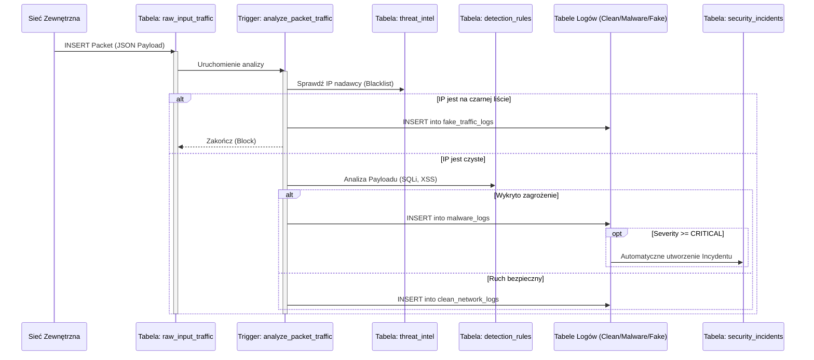
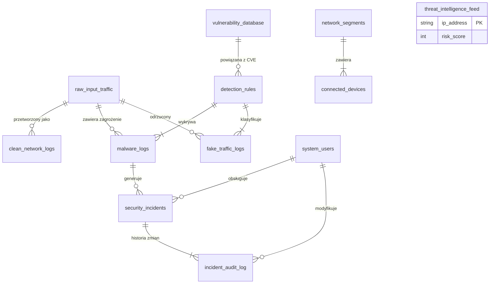

# Dokumentacja Techniczna Systemu Bazy Danych IDS/IPS (SIEM) 
**Technologia:** PostgreSQL 14+  
**Autorzy:** Jakub Szymczak, Tymoteusz Kruk, Kamil Pawelczak 


---

## 1. Wstęp
Projekt realizuje zaawansowaną symulację systemu **IDS/IPS** (Intrusion Detection/Prevention System) oraz **SIEM** (Security Information and Event Management) w oparciu o silnik relacyjnej bazy danych.

System działa w modelu **Store-and-Analyze**. Głównym celem jest:
*   Przechwytywanie surowego ruchu sieciowego.
*   Analiza w czasie rzeczywistym przy użyciu Triggerów i Procedur Składowanych.
*   Automatyczna klasyfikacja ruchu (**Czysty, Malware, Boty**).
*   Zarządzanie incydentami bezpieczeństwa (**Workflow analityka SOC**).

---

## 2. Architektura Systemu

### 2.1 Diagram Przepływu Danych (Sequence Diagram)
Poniższy diagram przedstawia cykl życia pojedynczego pakietu wpadającego do systemu.



### 2.2 Diagram Relacji Encji (ERD)
Struktura bazy danych składa się z 12 powiązanych tabel zarządzających różnymi aspektami bezpieczeństwa.



---

## 3. Opis Struktury Danych (Schema)

### 3.1 Moduł Konfiguracyjny (Słowniki)
Służy do definiowania reguł bezpieczeństwa i struktury sieci.

| Tabela | Opis | Kluczowe Pola |
| :--- | :--- | :--- |
| `system_users` | Użytkownicy systemu (Analitycy, Admini). | `role`, `is_active` |
| `network_segments` | Segmentacja sieci (DMZ, LAN, IoT). | `cidr_block`, `security_level` |
| `connected_devices` | Inwentaryzacja sprzętu. Śledzi zaufanie. | `mac_address`, `trust_level` |
| `detection_rules` | Definicje ataków (np. sygnatury SQLi). | `severity_level`, `threat_type` |
| `vulnerability_database` | Baza CVE powiązana z regułami. | `cve_id`, `base_score` |
| `threat_intelligence_feed` | Zewnętrzne listy "złych IP". | `risk_score`, `provider` |

### 3.2 Moduł Przetwarzania (Logi)
Dane generowane automatycznie przez triggery w procesie analizy.

| Tabela | Opis | Kluczowe Pola |
| :--- | :--- | :--- |
| `raw_input_traffic` | Bufor wejściowy. Każdy pakiet tu trafia. | `raw_packet_payload` (JSONB) |
| `clean_network_logs` | Ruch uznany za bezpieczny. | `processed_at` |
| `malware_logs` | Ruch zawierający złośliwy kod. | `quarantined_payload` |
| `fake_traffic_logs` | Ruch botów, skanery, blokady IP. | `action_taken`, `request_frequency` |

### 3.3 Moduł Zarządzania Incydentami (SOC)
Obsługa zdarzeń przez analityków bezpieczeństwa.

| Tabela | Opis | Kluczowe Pola |
| :--- | :--- | :--- |
| `security_incidents` | Tickety dla analityków. | `status`, `severity`, `assigned_user` |
| `incident_audit_log` | Historia zmian (RODO/Compliance). | `old_status`, `new_status`, `changed_by` |

---

## 4. Logika Biznesowa (Triggery)
System posiada 5 kluczowych triggerów sterujących przepływem danych:

1.  **`analyze_packet_traffic` (Główny Silnik)**
    *   Sprawdza IP w `threat_intelligence_feed`.
    *   Analizuje JSON pod kątem słów kluczowych (np. `UNION SELECT`, `<script>`).
    *   Rozdziela ruch do odpowiednich tabel logów.
2.  **`auto_incident_creation` (Automatyzacja)**
    *   Nasłuchuje na `malware_logs`.
    *   Dla zagrożeń `CRITICAL` tworzy wpis w `security_incidents` ze statusem `OPEN`.
3.  **`detect_scan_burst` (Obrona Aktywna)**
    *   Jeśli jedno IP zostanie zablokowane 5 razy w ciągu minuty w `fake_traffic_logs`, trafia na czarną listę (Auto-Ban).
4.  **`audit_incident_changes` (Audyt)**
    *   Rejestruje każdą zmianę statusu lub przypisania incydentu.
5.  **`update_device_presence` (Visibility)**
    *   Aktualizuje `last_seen` w tabeli urządzeń przy każdym pakiecie.

---

## 5. Scenariusze Testowe (Test Cases)

### Scenariusz A: Wykrywanie SQL Injection
*   **Akcja:** Wysłanie pakietu z payloadem `{"query": "UNION SELECT..."}`.
*   **Oczekiwany rezultat:** Wpis w `malware_logs`, automatyczne utworzenie incydentu `CRITICAL`.
```sql
SELECT * FROM malware_logs 
WHERE quarantined_payload::text LIKE '%UNION SELECT%';
```

### Scenariusz B: Blokada Threat Intel
*   **Akcja:** Wysłanie pakietu z adresu IP znajdującego się w czarnej liście.
*   **Oczekiwany rezultat:** Natychmiastowe przeniesienie do `fake_traffic_logs` (powód: `BLOCKED_THREAT_INTEL`).

### Scenariusz C: Raport Analityka (Dashboard)
*   **Akcja:** Wyświetlenie bieżącej kolejki zadań przez widok `v_analyst_queue`.
```sql
SELECT incident_id, severity, assigned_user 
FROM v_analyst_queue 
WHERE status = 'OPEN';
```

---

## 6. Optymalizacja Wydajności
W projekcie zastosowano indeksy specjalistyczne PostgreSQL:

*   **GIN (Generalized Inverted Index):** Na kolumnie `raw_packet_payload` (JSONB). Umożliwia błyskawiczne przeszukiwanie treści pakietów.
*   **BRIN (Block Range Index):** Na kolumnach czasowych (`arrival_time`). Oszczędza miejsce przy dużych zbiorach danych historycznych.
*   **B-Tree:** Na kluczach obcych i adresach IP.

**Przykład analizy wydajności:**
```sql
EXPLAIN ANALYZE 
SELECT * FROM raw_input_traffic 
WHERE raw_packet_payload @> '{"method": "GET"}';
-- Wynik: Bitmap Index Scan on idx_raw_payload_gin
```

---

## 7. Podsumowanie
Stworzony system bazy danych spełnia wymagania nowoczesnego rozwiązania **SIEM** w skali mikro. Jest odporny na błędy, audytowalny i zoptymalizowany pod kątem JSON. Architektura modularna pozwala na łatwe dodawanie nowych reguł detekcji bez przestojów systemu.
